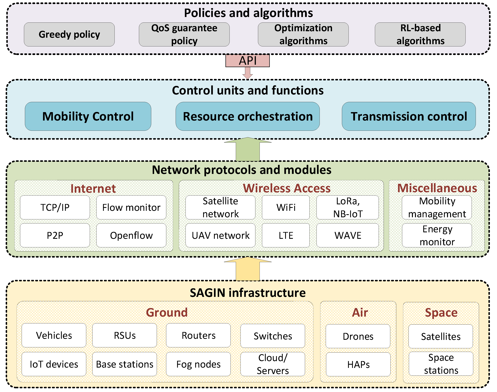
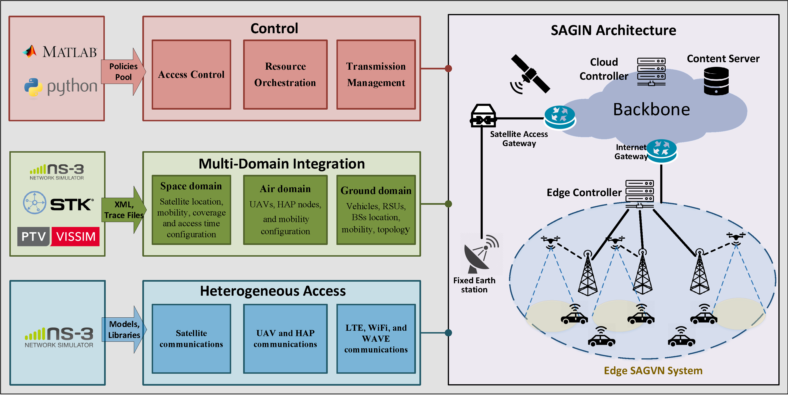
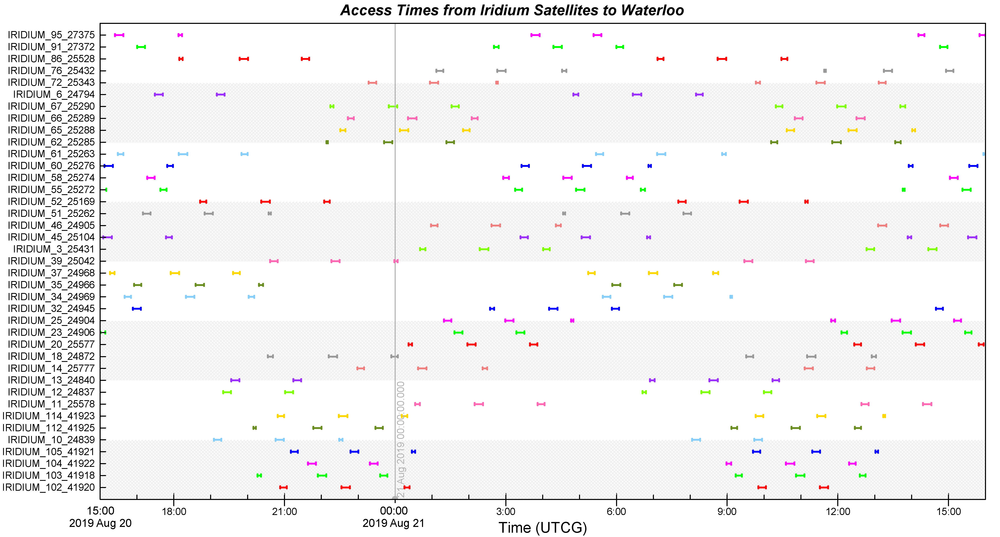
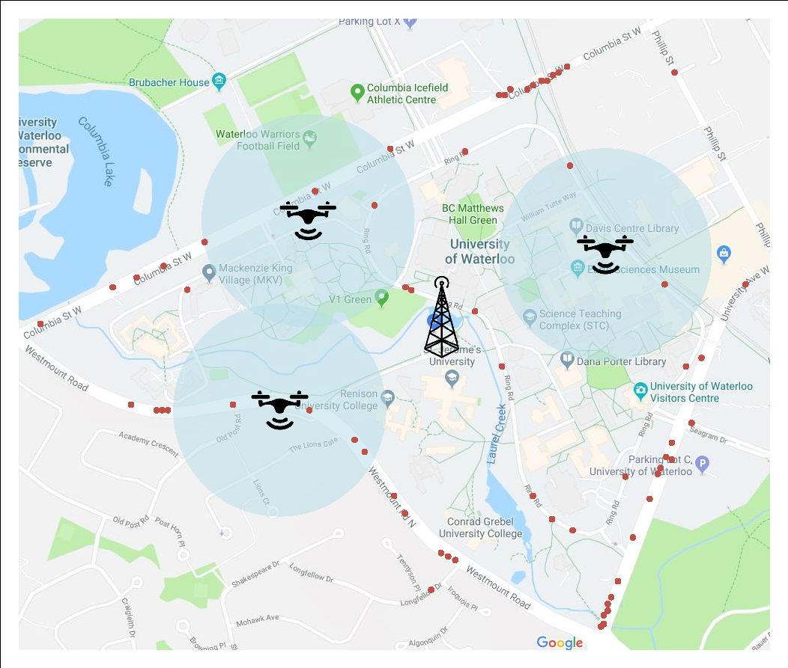
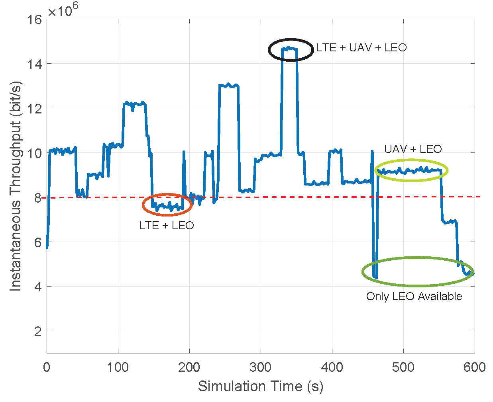
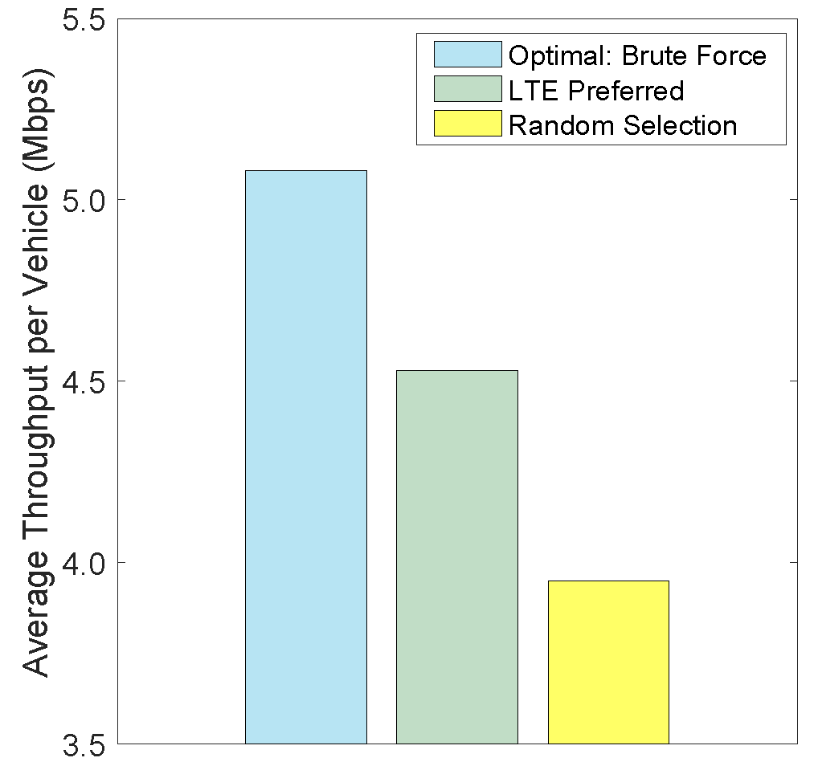
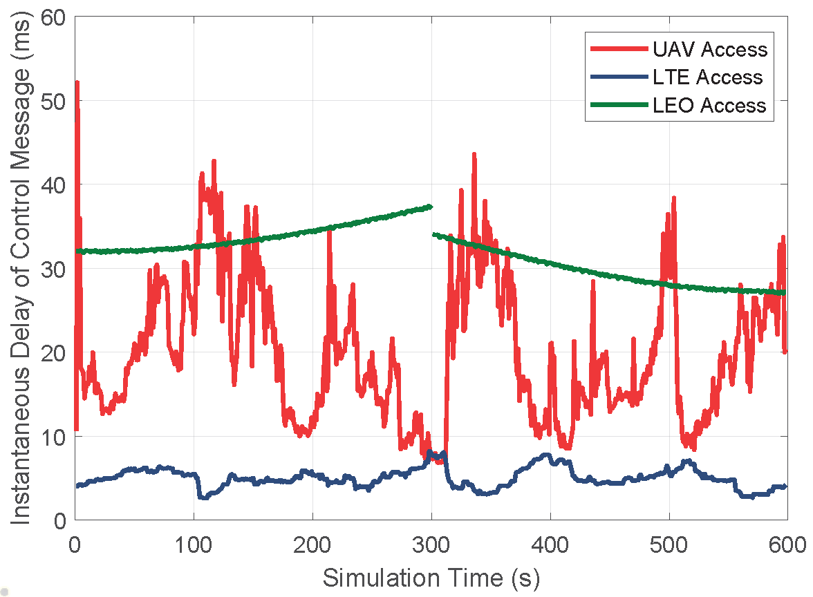

# A Comprehensive Simulation Platform for Space-Air-Ground Integrated Network

[A Comprehensive Simulation Platform for Space-Air-Ground Integrated Network](https://ieeexplore.ieee.org/abstract/document/8994207)

Nan Cheng<sup>1</sup>, Wei Quan<sup>2</sup>, Weisen Shi<sup>3</sup>, Huaqing Wu<sup>3</sup>, Qiang Ye<sup>4</sup>, Haibo Zhou<sup>5</sup>, Weihua Zhuang<sup>3</sup>, Xuemin (Sherman) Shen<sup>3</sup>, and Bo Bai<sup>6</sup>

<sup>1</sup>Xidian University, <sup>2</sup>Beijing Jiaotong University, <sup>3</sup>University of Waterloo, <sup>4</sup>Minnesota State University, <sup>5</sup>Nanjing University, <sup>6</sup>Huawei Technologies Co.

in [IEEE Wireless Communications( Volume: 27, Issue: 1,February 2020)](https://ieeexplore.ieee.org/xpl/RecentIssue.jsp?punumber=7742)

### Bibtex

If you find this work useful for your research and applications, please cite using this BibTeX:

```
@Article{8994207,
  author  = {Cheng, Nan and Quan, Wei and Shi, Weisen and Wu, Huaqing and Ye, Qiang and Zhou, Haibo and Zhuang, Weihua and Shen, Xuemin and Bai, Bo},
  journal = {IEEE Wireless Communications},
  title   = {A Comprehensive Simulation Platform for Space-Air-Ground Integrated Network},
  year    = {2020},
  number  = {1},
  pages   = {178-185},
  volume  = {27},
  doi     = {10.1109/MWC.001.1900072},
}
```

## Background

Space-air-ground integrated network (SAGIN) is envisioned as a promising solution to provide cost-effective, large-scale, and flexible wireless coverage and communication services. Real-world deployment and testing of SAGIN is difficult and expensive, so an efficient simulation platform is necessary. We presents a developed SAGIN simulation platform that supports various mobility traces and protocols of space, aerial, and terrestrial networks.

## Our work

We developed a comprehensive SAGIN simulation platform that supports various mobility traces and protocols of space, aerial, and terrestrial networks. The platform integrates centralized and decentralized controllers to optimize network functions such as access control and resource orchestration. We also implemented various interfaces to extend the functionality of the platform, allowing for user-defined mobility traces and control algorithms. Additionally, we conducted a case study on heterogeneous vehicular access control using the platform. The simulation platform can be used by researchers and developers to evaluate new protocols and algorithms in the context of SAGIN.

The designed simulation platform can perform comprehensive and flexible SAGIN evaluation by implementing the following distinct features.

- **Integration:** The space, aerial, and ground network and communication functions are supported simultaneously in the platform by integrating different simulation software.
- **Controllability:** Network controllers are implemented in the simulation platform.
- **Flexibility:** We implement various interfaces to support the functionality of the simulation platform.

## SAGIN simulation platform

The SAGIN simulation platform is composed of three layers: the SAGIN infrastructure layer, the network module layer, and the application and control layer. Each layer has specific functionalities and supports the upper layers. The SAGIN infrastructure layer builds the physical environment of the simulation platform, including the Earth representation, digital map, and communication infrastructure. It also generates and maintains the position and mobility of network nodes. The network module layer simulates a complex integrated network that supports various communication and networking protocols, such as satellite communication, aerial communications, LTE, WiFi, and IoT. Different network protocols are implemented in separate modules, allowing for easy configuration and modification. The application and control layer deploys various control algorithms and SAGIN applications based on the functions provided by the infrastructure and network module layers. It controls the behaviors of the network and implements user-defined applications and control policies. The platform also supports centralized and decentralized control, allowing for efficient resource allocation and evaluation of different control algorithms. Overall, the SAGIN simulation platform provides a unified environment for simulating and evaluating SAGINs, integrating different simulation tools and supporting the integration of mobility traces and datasets from different network segments.



## Design of the SAGIN simulation platform

The SAGIN simulation platform is designed to simulate communication and networking protocols while also supporting various existing and potential SAG applications and services. The platform efficiently supports existing network protocols and can be easily extended to implement new communication protocols, algorithms, control schemes, and applications. The platform consists of three layers: the SAGIN infrastructure layer, the network module layer, and the application and control layer. Each layer has specific functionalities and supports the upper layers. APIs are designed to extend the platform with specific applications and control algorithms.

- **SAGIN infrastructure layer:** This layer builds the physical environment of the simulation platform, including the Earth representation, digital map, vehicles, RSUs, IoT devices, base stations, routers, fog nodes, switches, cloud/servers, drones, HAPs, etc. It addresses the challenge of simulating realistic SAG environments by considering the distinct network characteristics and various protocols and mobility patterns of the space, aerial, and ground network segments.
- **Network protocols and modules layer:** This layer integrates different simulation tools to realize the functions of the platform, such as mobility generation and maintenance, network control, SAGIN communication protocols, and simulation result analysis and visualization. It employs NS-3 as the core simulator and designs efficient parsers and interfaces to connect to other platform components for a unified simulation. The simulation scenario includes the configuration of network components, determination of network topology and node mobility, and deployment of network services.
- **Application and control layer:** This layer plays two important roles: controlling the behaviors of the network and implementing user-defined applications and control policies. Network controllers are deployed in the network edge and cloud to monitor the network, collect real-time network information, and control network behaviors in a centralized and decentralized way. The control layer also implements user interfaces to realize customized applications and control algorithms.

The SAGIN simulation platform integrates different simulation tools, supports heterogeneous access and multi-domain integration, and enables centralized and decentralized control. It provides flexibility, scalability, and extensibility to support various SAG applications and services.



## Implementation details

The simulation platform integrates different simulation tools to realize the functions of the platform, such as mobility generation and maintenance, network control, SAGIN communication protocols, and simulation result analysis and visualization. The picture shows the main functions supported in the SAGIN simulation platform and how to implement the simulation platform by integrating existing tools.

**Simulation scenario**: The simulation scenario includes the configuration of network components, determination of network topology and node mobility, deployment of network services, etc. The simulation scenario is supported by two functions, i.e., heterogeneous access and multi-domain integration.

**Centralized and decentralized control**: The network control layer plays two important roles, i.e., controlling the behaviors of the network and implementing the user-defined applications and control policies.

**Core simulation**: Based on the simulation scenario and the network control algorithms, the simulation process is conducted using NS-3.





## Case study

According to the information provided, the purpose of the picture follows in the paper is to illustrate a specific case study in vehicular communications, specifically focusing on radio access technology (RAT) selection and control. The simulation scenario depicted in this figure considers the area around the campus of the University of Waterloo. Each vehicle in the scenario is equipped with three different network interfaces: LTE, DSRC, and UT, which connect to network access points such as base stations, UAVs, and satellites. The Iridium satellite constellation is used for LEO satellite communications. 







The figure shows the simulation scenario, including the deployment of an LTE base station, trajectories of UAVs, and the location of the network controller. The network controller is responsible for controlling the actions of all network components in the SAGIN (Satellite-Aerial-Ground Integrated Network). It collects real-time network information, makes decisions based on the information, and disseminates control messages to the network components. The figure also highlights the three-dimensional heterogeneous RAT selection and the network-controlled throughput-maximization RAT selection, which are analyzed in the case study.